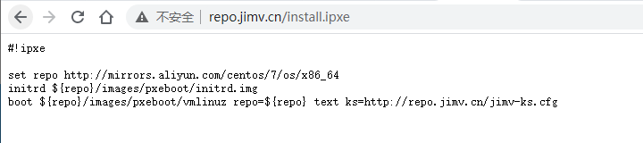
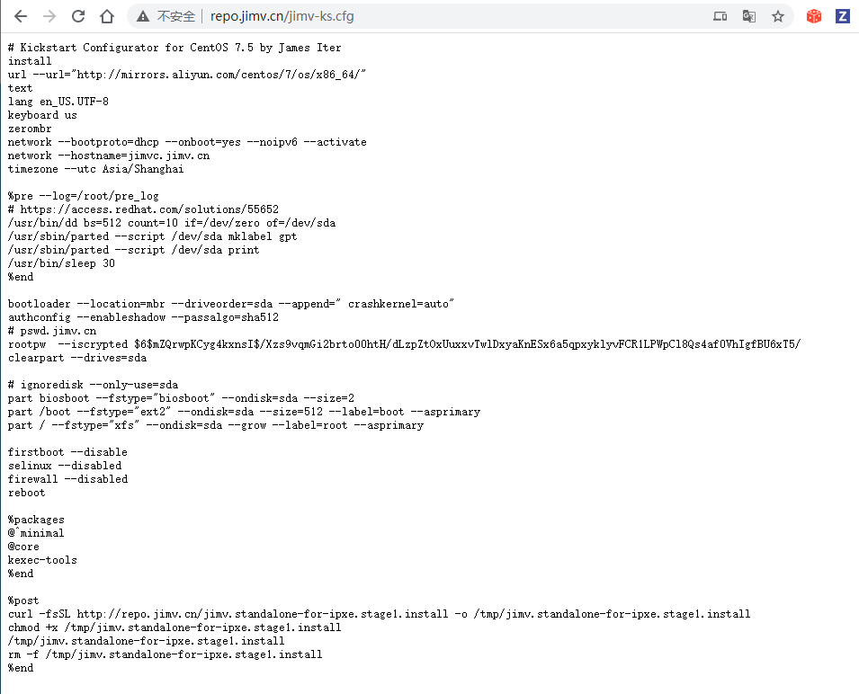
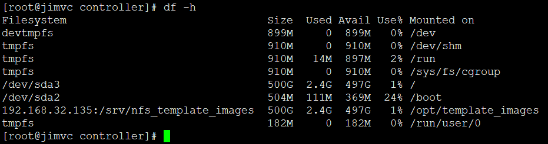
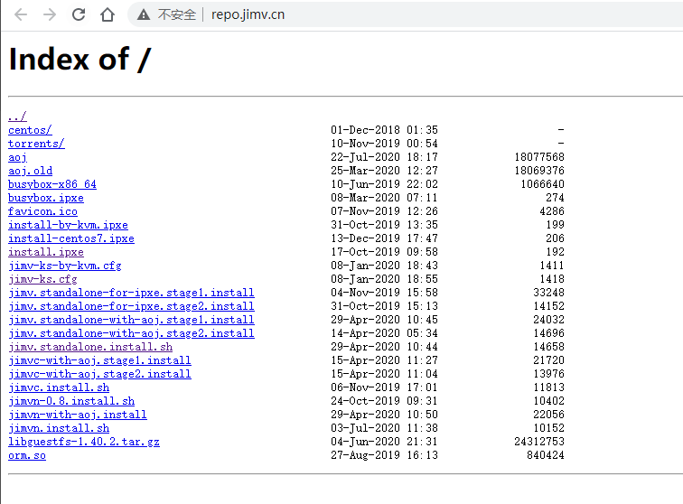
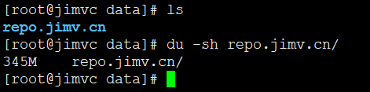
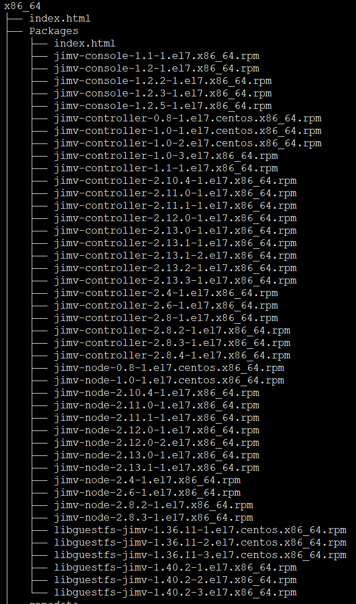

# iPXE分析

## 第一步

* <https://jimv.cn/docs.html#>


* iPXE需要主板BIOS支持，要么就是扩展成iso，光盘镜像U盘启动一类。其本质相当于一个mini linux，支持网络，支持pxe特有的批处理文件支持

```
boot http://repo.jimv.cn/install.ipxe
```



* 浏览器直接打开，其实就是个配置，pxe可以是别的配置，pxe特有的语法参数
* set 环境变量，repo=http://mirrors.aliyun.com/centos/7/os/x86_64
* initrd 存在在哪个网络url路径下
* 内核在哪个url路径下
* 内核用boot参数，触发链式跳转。权限从ipxe跳转到vmlinuz（压缩的linux内核）
* 内核参数 text ks=.. 说明文本模式，且进入kickstart环境
* kickstart就是centos特有的用来自动化安装的东西。ubuntu也有类似的ubiquity，其本质是通过一堆功能丰富的脚本实现自动化安装系统的流程
* 自动化安装，脚本在initrd中，initrd就是内存文件系统，临时文件系统。平常U盘装系统就是把PE系统在内存里跑起来，不依赖磁盘，这样就可以分区装系统了。
* kickstart又是另一套环境，kickstart有自己特有的配置，ks文件，支持丰富的语法，无人值守安装就靠它了，他的逻辑比pxe复杂很多
* 能不能安装好理想的OS，关键就是ks文件写好。ipxe只是敲门砖

```
#!ipxe

set repo http://mirrors.aliyun.com/centos/7/os/x86_64
initrd ${repo}/images/pxeboot/initrd.img
boot ${repo}/images/pxeboot/vmlinuz repo=${repo} text ks=http://repo.jimv.cn/jimv-ks.cfg
```


## kickstart配置

* 浏览器打开<http://repo.jimv.cn/jimv-ks.cfg>



```
# Kickstart Configurator for CentOS 7.5 by James Iter
install
url --url="http://mirrors.aliyun.com/centos/7/os/x86_64/"
text
lang en_US.UTF-8
keyboard us
zerombr
network --bootproto=dhcp --onboot=yes --noipv6 --activate
network --hostname=jimvc.jimv.cn
timezone --utc Asia/Shanghai

%pre --log=/root/pre_log
# https://access.redhat.com/solutions/55652
/usr/bin/dd bs=512 count=10 if=/dev/zero of=/dev/sda
/usr/sbin/parted --script /dev/sda mklabel gpt
/usr/sbin/parted --script /dev/sda print
/usr/bin/sleep 30
%end

bootloader --location=mbr --driveorder=sda --append=" crashkernel=auto"
authconfig --enableshadow --passalgo=sha512
# pswd.jimv.cn
rootpw  --iscrypted $6$mZQrwpKCyg4kxnsI$/Xzs9vqmGi2brto00htH/dLzpZtOxUuxxvTwlDxyaKnESx6a5qpxyklyvFCR1LPWpCl8Qs4af0VhIgfBU6xT5/
clearpart --drives=sda

# ignoredisk --only-use=sda
part biosboot --fstype="biosboot" --ondisk=sda --size=2
part /boot --fstype="ext2" --ondisk=sda --size=512 --label=boot --asprimary
part / --fstype="xfs" --ondisk=sda --grow --label=root --asprimary

firstboot --disable
selinux --disabled
firewall --disabled
reboot

%packages
@^minimal
@core
kexec-tools
%end

%post
curl -fsSL http://repo.jimv.cn/jimv.standalone-for-ipxe.stage1.install -o /tmp/jimv.standalone-for-ipxe.stage1.install
chmod +x /tmp/jimv.standalone-for-ipxe.stage1.install
/tmp/jimv.standalone-for-ipxe.stage1.install
rm -f /tmp/jimv.standalone-for-ipxe.stage1.install
%end
```

* 这里的安装过程其实是anaconda安装程序去处理
* 典型的配置语言，键盘，网络，时区，主机名，分区
  - keyboard 配置键盘
  - network --bootproto=dhcp --onboot=yes --noipv6 --activate 配置网络dhcp自动获取
  - timezone --utc Asia/Shanghai 配置时区亚洲上海，红帽上基本都是上海。北京大大对linux并不关注
  - /usr/bin/dd bs=512 count=10 if=/dev/zero of=/dev/sda 默认用sda盘，格式化。如果你是SSD怎么办？
  - bootloader --location=mbr --driveorder=sda --append=" crashkernel=auto" 配置启动引导，选定sda
  - rootpw  --iscrypted $6$mZQrwpKCyg4kxnsI$/Xzs9vqmGi2brto00htH/dLzpZtOxUuxxvTwlDxyaKnESx6a5qpxyklyvFCR1LPWpCl8Qs4af0VhIgfBU6xT5/ 配置密码
  - @^minimal @core 就是centos组包安装的概念
  - firewall --disabled 关闭防火墙。。这操作太骚，不建议
  - centos基本环境定了之后就是安装jimv全家桶了




## jimv组件安装

```
curl -fsSL http://repo.jimv.cn/jimv.standalone-for-ipxe.stage1.install -o /tmp/jimv.standalone-for-ipxe.stage1.install
chmod +x /tmp/jimv.standalone-for-ipxe.stage1.install
/tmp/jimv.standalone-for-ipxe.stage1.install
rm -f /tmp/jimv.standalone-for-ipxe.stage1.install
```

* 这堆命令无非就是要执行 ```http://repo.jimv.cn/jimv.standalone-for-ipxe.stage1.install``` 程序
* 好家伙，这是个二进制程序

```
[root@jimvc controller]# file jimv.standalone-for-ipxe.stage1.install
jimv.standalone-for-ipxe.stage1.install: ELF 64-bit LSB executable, x86-64, version 1 (SYSV), dynamically linked (uses shared libs), for GNU/Linux 2.6.32, BuildID[sha1]=b8e64b229735c3066d54c1ce89eeffd18167e17c, stripped
[root@jimvc controller]#
```

## jimv仓库

* <http://repo.jimv.cn/>



* 全站批量下载。。。先搞下来慢慢研究

```
wget -np -m http://repo.jimv.cn/
```



* 一共300多MB内容，包括yum仓库

 

---
