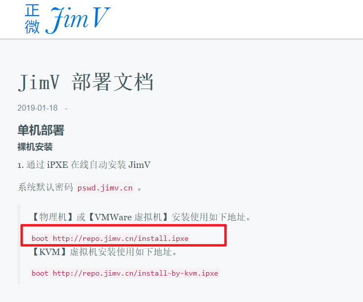
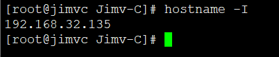

<!-- MDTOC maxdepth:6 firsth1:1 numbering:0 flatten:0 bullets:1 updateOnSave:1 -->

- [iPXE分析](#ipxe分析)   
   - [第一步](#第一步)   
   - [kickstart配置](#kickstart配置)   
   - [jimv组件安装](#jimv组件安装)   
   - [jimv仓库](#jimv仓库)   
   - [install脚本分析](#install脚本分析)   
      - [http://repo.jimv.cn/jimvc.install.sh](#httprepojimvcnjimvcinstallsh)   
      - [INSTALL.sh](#installsh)   

<!-- /MDTOC -->
# iPXE分析

## 第一步

* <https://jimv.cn/docs.html#>



* iPXE需要主板BIOS支持，要么就是扩展成iso，光盘镜像U盘启动一类。其本质相当于一个mini linux，支持网络，支持pxe特有的批处理文件支持

```
boot http://repo.jimv.cn/install.ipxe
```


* 浏览器直接打开，其实就是个配置，pxe可以是别的配置，pxe特有的语法参数
* set 环境变量，repo=http://mirrors.aliyun.com/centos/7/os/x86_64
* initrd 存在在哪个网络url路径下
* 内核在哪个url路径下
* 内核用boot参数，触发链式跳转。权限从ipxe跳转到vmlinuz（压缩的linux内核）
* 内核参数 text ks=.. 说明文本模式，且进入kickstart环境
* kickstart就是centos特有的用来自动化安装的东西。ubuntu也有类似的ubiquity，其本质是通过一堆功能丰富的脚本实现自动化安装系统的流程
* 自动化安装，脚本在initrd中，initrd就是内存文件系统，临时文件系统。平常U盘装系统就是把PE系统在内存里跑起来，不依赖磁盘，这样就可以分区装系统了。
* kickstart又是另一套环境，kickstart有自己特有的配置，ks文件，支持丰富的语法，无人值守安装就靠它了，他的逻辑比pxe复杂很多
* 能不能安装好理想的OS，关键就是ks文件写好。ipxe只是敲门砖

```
#!ipxe

set repo http://mirrors.aliyun.com/centos/7/os/x86_64
initrd ${repo}/images/pxeboot/initrd.img
boot ${repo}/images/pxeboot/vmlinuz repo=${repo} text ks=http://repo.jimv.cn/jimv-ks.cfg
```


## kickstart配置

* 浏览器打开<http://repo.jimv.cn/jimv-ks.cfg>


```
# Kickstart Configurator for CentOS 7.5 by James Iter
install
url --url="http://mirrors.aliyun.com/centos/7/os/x86_64/"
text
lang en_US.UTF-8
keyboard us
zerombr
network --bootproto=dhcp --onboot=yes --noipv6 --activate
network --hostname=jimvc.jimv.cn
timezone --utc Asia/Shanghai

%pre --log=/root/pre_log
# https://access.redhat.com/solutions/55652
/usr/bin/dd bs=512 count=10 if=/dev/zero of=/dev/sda
/usr/sbin/parted --script /dev/sda mklabel gpt
/usr/sbin/parted --script /dev/sda print
/usr/bin/sleep 30
%end

bootloader --location=mbr --driveorder=sda --append=" crashkernel=auto"
authconfig --enableshadow --passalgo=sha512
# pswd.jimv.cn
rootpw  --iscrypted $6$mZQrwpKCyg4kxnsI$/Xzs9vqmGi2brto00htH/dLzpZtOxUuxxvTwlDxyaKnESx6a5qpxyklyvFCR1LPWpCl8Qs4af0VhIgfBU6xT5/
clearpart --drives=sda

# ignoredisk --only-use=sda
part biosboot --fstype="biosboot" --ondisk=sda --size=2
part /boot --fstype="ext2" --ondisk=sda --size=512 --label=boot --asprimary
part / --fstype="xfs" --ondisk=sda --grow --label=root --asprimary

firstboot --disable
selinux --disabled
firewall --disabled
reboot

%packages
@^minimal
@core
kexec-tools
%end

%post
curl -fsSL http://repo.jimv.cn/jimv.standalone-for-ipxe.stage1.install -o /tmp/jimv.standalone-for-ipxe.stage1.install
chmod +x /tmp/jimv.standalone-for-ipxe.stage1.install
/tmp/jimv.standalone-for-ipxe.stage1.install
rm -f /tmp/jimv.standalone-for-ipxe.stage1.install
%end
```

* 这里的安装过程其实是anaconda安装程序去处理
* 典型的配置语言，键盘，网络，时区，主机名，分区
  - keyboard 配置键盘
  - network --bootproto=dhcp --onboot=yes --noipv6 --activate 配置网络dhcp自动获取
  - timezone --utc Asia/Shanghai 配置时区亚洲上海，红帽上基本都是上海。北京大大对linux并不关注
  - /usr/bin/dd bs=512 count=10 if=/dev/zero of=/dev/sda 默认用sda盘，格式化。如果你是SSD怎么办？
  - bootloader --location=mbr --driveorder=sda --append=" crashkernel=auto" 配置启动引导，选定sda
  - rootpw  --iscrypted $6$mZQrwpKCyg4kxnsI$/Xzs9vqmGi2brto00htH/dLzpZtOxUuxxvTwlDxyaKnESx6a5qpxyklyvFCR1LPWpCl8Qs4af0VhIgfBU6xT5/ 配置密码
  - @^minimal @core 就是centos组包安装的概念
  - firewall --disabled 关闭防火墙。。这操作太骚，不建议
  - centos基本环境定了之后就是安装jimv全家桶了


## jimv组件安装

```
curl -fsSL http://repo.jimv.cn/jimv.standalone-for-ipxe.stage1.install -o /tmp/jimv.standalone-for-ipxe.stage1.install
chmod +x /tmp/jimv.standalone-for-ipxe.stage1.install
/tmp/jimv.standalone-for-ipxe.stage1.install
rm -f /tmp/jimv.standalone-for-ipxe.stage1.install
```

* 这堆命令无非就是要执行 ```http://repo.jimv.cn/jimv.standalone-for-ipxe.stage1.install``` 程序
* 好家伙，这是个二进制程序。看着内容很可能是shc搞得，脚本转剥离的二进制

```
[root@jimvc controller]# file jimv.standalone-for-ipxe.stage1.install
jimv.standalone-for-ipxe.stage1.install: ELF 64-bit LSB executable, x86-64, version 1 (SYSV), dynamically linked (uses shared libs), for GNU/Linux 2.6.32, BuildID[sha1]=b8e64b229735c3066d54c1ce89eeffd18167e17c, stripped
[root@jimvc controller]#
```


* 其实感觉没多大必要哈，毕竟还有INSTALL.sh脚本呢，暂不管这个二进制

## jimv仓库

* <http://repo.jimv.cn/>


* 全站批量下载。。。先搞下来慢慢研究

```
wget -np -m http://repo.jimv.cn/
```


* 一共300多MB内容，包括yum仓库


## install脚本分析

* 从jimvc仓库下载的install脚本与git仓库有所区别


### http://repo.jimv.cn/jimvc.install.sh

```
#!/usr/bin/env bash
#
# JimV-C
#
# Copyright (C) 2017 JimV <james.iter.cn@gmail.com>
#
# Author: James Iter <james.iter.cn@gmail.com>
#
#   This script will help you to automation install JimV-C.
#
# Example:
#   Pass arguments to the installer.
#   curl https://raw.githubusercontent.com/jamesiter/JimV-C/dev/INSTALL.sh | bash -s -- --version dev
#   bash -c "$(curl -fsSL https://raw.githubusercontent.com/jamesiter/JimV-C/dev/INSTALL.sh)" -- --version dev

export PYPI='https://mirrors.aliyun.com/pypi/simple/'
export SMTP_HOST=''
export SMTP_USER=''
export SMTP_PASSWORD=''
export TOKEN=`echo $[$RANDOM]|md5sum|cut -c 1-32`  # $RANDOM 随机数生成器
# 代替语句 ifconfig | grep -Eo 'inet (addr:)?([0-9]*\.){3}[0-9]*' | grep -Eo '([0-9]*\.){3}[0-9]*' | grep -v '127.0.0.1'
SERVER_IP=`hostname -I`; export SERVER_IP=${SERVER_IP%% *}

ARGS=`getopt -o h --long rdb_root_password:,rdb_jimv_password:,redis_password:,jwt_secret:,secret_key:,version:,help -n 'INSTALL.sh' -- "$@"`

eval set -- "${ARGS}"

while true
do
    case "$1" in
        --rdb_root_password)
            export RDB_ROOT_PSWD=$2
            shift 2
            ;;
        --rdb_jimv_password)
            export RDB_JIMV_PSWD=$2
            shift 2
            ;;
        --redis_password)
            export REDIS_PSWD=$2
            shift 2
            ;;
        --jwt_secret)
            export JWT_SECRET=$2
            shift 2
            ;;
        --secret_key)
            export SECRET_KEY=$2
            shift 2
            ;;
        --version)
            export JIMV_VERSION=$2
            export JIMVC_DOWNLOAD_URL=$(sed s@master@${JIMV_VERSION}@ <<< ${JIMVC_DOWNLOAD_URL})
            shift 2
            ;;
        -h|--help)
            echo 'INSTALL.sh [-h|--help|--rdb_root_password|--rdb_jimv_password|--redis_password|--jwt_secret|--secret_key|--version]'
            exit 0
            ;;
        --)
            shift
            break
            ;;
        *)
            echo "Internal error!"
            exit 1
            ;;
    esac
done

# 检测环境，是否是红帽系列，否则不支持
# 默认支持centos fedora rhel
function check_precondition() {
    source /etc/os-release
    case ${ID} in
    centos|fedora|rhel)
        if [[ ${VERSION_ID} -lt 7 ]]; then
            echo "System version must greater than or equal to 7, We found ${VERSION_ID}."
	        exit 1
        fi
        ;;
    *)
        echo "${ID} is unknown, Please to be installed manually."
	    exit 1
        ;;
    esac
}

# 一直不解这个布局好是什么意思，其实就是要配置域名，让其他节点可以访问到。但是如果我只有一个center一个node且都是在一台机器上，那还配置个锤子？
# 这里对小白很不友好
function ensure_hosts_layout() {
    echo "______________________________________________________________________________"
    /bin/cat /etc/hosts
    echo
    read -p "您已经布局好 /etc/hosts 了吗 [Y/N]? " answer

    if [[  "x_"${answer} != "x_Y" ]] && [[ "x_"${answer} != "x_y" ]]; then
        echo "OK, good bye!";
        exit 0
    fi
}

# 生成ssh-key
function sync_ssh_key_pair() {
    sed -i 's@.*StrictHostKeyChecking.*@StrictHostKeyChecking no@' /etc/ssh/ssh_config

    rm -f ~/.ssh/id_rsa ~/.ssh/id_rsa.pub; echo -e "\n\n\n" | ssh-keygen -N ""
    echo >> ~/.ssh/authorized_keys
    cat ~/.ssh/id_rsa.pub >> ~/.ssh/authorized_keys
    chmod 0600 ~/.ssh/authorized_keys

    DHOSTS=`egrep -v '^$|localhost|jimvc' /etc/hosts | awk '{ print $1; }'`

    for dhost in ${DHOSTS}
    do
        scp -r ~/.ssh ${dhost}:~/
        # 关闭 SSH 服务器端 Key 校验
        ssh ${dhost} "sed -i 's@.*StrictHostKeyChecking.*@StrictHostKeyChecking no@' /etc/ssh/ssh_config"
    done
}

# 这里应该是为了集群配置，公用一份秘钥？
function sync_hosts_file() {
    DHOSTS=`egrep -v '^$|localhost|jimvc' /etc/hosts | awk '{ print $1; }'`

    for dhost in ${DHOSTS}
    do
        scp /etc/hosts ${dhost}:/etc/hosts
    done
}

# 配置yum源，用阿里云，为嘛不用腾讯云？
function custom_repository_origin() {
    mv /etc/yum.repos.d/CentOS-Base.repo /etc/yum.repos.d/CentOS-Base.repo.backup
    mv /etc/yum.repos.d/epel.repo /etc/yum.repos.d/epel.repo.backup
    mv /etc/yum.repos.d/epel-testing.repo /etc/yum.repos.d/epel-testing.repo.backup
    curl -o /etc/yum.repos.d/CentOS-Base.repo http://mirrors.aliyun.com/repo/Centos-7.repo
    curl -o /etc/yum.repos.d/epel.repo http://mirrors.aliyun.com/repo/epel-7.repo
    sed -i '/aliyuncs/d' /etc/yum.repos.d/*.repo
    yum clean all
    yum makecache
}

# 安装epel，命令补齐
function prepare() {

    if [[ ! ${JIMV_VERSION} ]] || [[ ${#JIMV_VERSION} -eq 0 ]]; then
        export JIMV_VERSION='master'
    fi

    yum install epel-release -y
    yum install bash-completion-extras -y
}

# 同步时间，配置时区上海
function sync_datetime() {
    yum install chrony -y
    systemctl start chronyd
    systemctl enable chronyd
    timedatectl set-timezone Asia/Shanghai
    timedatectl set-ntp true
}

# 清空环境，直接就关闭防火墙，关闭selinux了？？？好骚的操作
function clear_up_environment() {
    systemctl stop firewalld
    systemctl disable firewalld
    systemctl stop NetworkManager
    systemctl disable NetworkManager

    sed -i 's@SELINUX=enforcing@SELINUX=disabled@g' /etc/sysconfig/selinux
    sed -i 's@SELINUX=enforcing@SELINUX=disabled@g' /etc/selinux/config
    setenforce 0

    sed -i '/\/tmp\/jimv.*/d' /usr/lib/tmpfiles.d/tmp.conf
    echo 'x /tmp/jimv*' >> /usr/lib/tmpfiles.d/tmp.conf
}

# 配置jimv源，使用源安装jimv-controller
function install_JimVC() {
    cat > /etc/yum.repos.d/JimV.repo << EOF
[JimV]
name=JimV - \$basearch
baseurl=http://repo.cdn.jimv.cn/centos/7/os/\$basearch
        http://repo.jimv.cn/centos/7/os/\$basearch
        http://repo.jimv.io/centos/7/os/\$basearch
        http://repo.iit.im/centos/7/os/\$basearch
failovermethod=priority
enabled=1
gpgcheck=0
gpgkey=https://repo.jimv.cn/RPM-GPG-KEY-JIMV-114EA591
EOF
    yum install jimv-controller -y
}


function install_JimVConsole() {
    yum install jimv-console -y
}

# 生成各种密码
function generate_passwords() {
    export GENERATE_PASSWORD_SCRIPT='/usr/bin/gen_pswd.sh'

    if [[ ! ${RDB_ROOT_PSWD} ]] || [[ ${#RDB_ROOT_PSWD} -eq 0 ]]; then
        export RDB_ROOT_PSWD=`${GENERATE_PASSWORD_SCRIPT}`
    fi

    if [[ ! ${RDB_JIMV_PSWD} ]] || [[ ${#RDB_JIMV_PSWD} -eq 0 ]]; then
        export RDB_JIMV_PSWD=`${GENERATE_PASSWORD_SCRIPT}`
    fi

    if [[ ! ${REDIS_PSWD} ]] || [[ ${#REDIS_PSWD} -eq 0 ]]; then
        export REDIS_PSWD=`${GENERATE_PASSWORD_SCRIPT} 128`
    fi

    if [[ ! ${JWT_SECRET} ]] || [[ ${#JWT_SECRET} -eq 0 ]]; then
        export JWT_SECRET=`${GENERATE_PASSWORD_SCRIPT} 128`
    fi

    if [[ ! ${SECRET_KEY} ]] || [[ ${#SECRET_KEY} -eq 0 ]]; then
        export SECRET_KEY=`${GENERATE_PASSWORD_SCRIPT} 128`
    fi
}

# 创建www用户
function create_web_user() {
    useradd -M www
}

# 安装mariadb（mysql），修改service配置
function install_MariaDB() {
    # 安装 MariaDB
    yum install mariadb mariadb-server -y

    # 配置 MariaDB
    mkdir -p /etc/systemd/system/mariadb.service.d
    echo '[Service]' > /etc/systemd/system/mariadb.service.d/limits.conf
    echo 'LimitNOFILE=65535' >> /etc/systemd/system/mariadb.service.d/limits.conf
    systemctl --system daemon-reload

    sed -i '/^bind-address .*/d' /etc/my.cnf
    sed -i '/^log-bin.*/d' /etc/my.cnf
    sed -i '/^expire_logs_days .*/d' /etc/my.cnf
    sed -i '/^innodb_file_per_table .*/d' /etc/my.cnf
    sed -i '/^max_connections .*/d' /etc/my.cnf

    sed -i '/\[mysqld\]/a\bind-address = 127.0.0.1' /etc/my.cnf
    sed -i '/\[mysqld\]/a\log-bin' /etc/my.cnf
    sed -i '/\[mysqld\]/a\expire_logs_days = 1' /etc/my.cnf
    sed -i '/\[mysqld\]/a\innodb_file_per_table' /etc/my.cnf
    sed -i '/\[mysqld\]/a\max_connections = 10000' /etc/my.cnf

    # 启动并使其随机启动
    systemctl enable mariadb.service
    systemctl restart mariadb.service

# 初始化 MariaDB
mysql_secure_installation << EOF

Y
${RDB_ROOT_PSWD}
${RDB_ROOT_PSWD}
Y
Y
Y
Y
EOF

    # 测试是否部署成功
    mysql -u root -p${RDB_ROOT_PSWD} -e 'show databases'
    echo 'root:'${RDB_ROOT_PSWD} > /var/log/mariadb/mariadb.secret
}

# 安装redis，并配置
function install_Redis() {
    # 安装 Redis
    yum install redis -y

    # 配置 Redis
    sed -i '/^vm.overcommit_memory.*/d' /etc/sysctl.conf
    echo 'vm.overcommit_memory = 1' >> /etc/sysctl.conf

    sysctl -p
    sed -i 's@^daemonize no@daemonize yes@g' /etc/redis.conf
    sed -i 's@^bind 127.0.0.1@bind 0.0.0.0@g' /etc/redis.conf

    sed -i '/^requirepass .*/d' /etc/redis.conf
    echo "requirepass ${REDIS_PSWD}" >> /etc/redis.conf

    # 启动并使其随机启动
    systemctl enable redis.service
    systemctl start redis.service
}

# 安装nginx并配置
function install_Nginx() {
    # 安装 Nginx
    yum install nginx -y

    # 配置 Nginx
    mkdir -p /etc/jimv/keys
    chown -R www.www /var/lib/nginx
    cp -vf /usr/share/jimv/controller/misc/jimv.nginx /etc/nginx/nginx.conf
    sed -i 's@user .*nginx.*$@user www;@' /etc/nginx/nginx.conf

    # 启动并使其随机启动
    systemctl enable nginx.service
    systemctl start nginx.service
}

# 初始化mariadb数据库，导入已有 init.sql 数据库
function initialization_db() {
    # 建立 JimV 数据库专属用户
    mysql -u root -p${RDB_ROOT_PSWD} -e "grant all on jimv.* to jimv@localhost identified by \"${RDB_JIMV_PSWD}\"; flush privileges"

    # 初始化数据库
    mysql -u jimv -p${RDB_JIMV_PSWD} < /usr/share/jimv/controller/misc/init.sql

    # 确认是否初始化成功
    mysql -u jimv -p${RDB_JIMV_PSWD} -e 'show databases'
}

# 配置NFS
function install_NFS() {
    yum install nfs-utils -y
    mkdir -p /srv/nfs_template_images
    chown -R www.www /srv/nfs_template_images
    WWW_UID=$(id -u www)
    WWW_GID=$(id -g www)
    cat > /etc/exports << EOF
/srv/nfs_template_images    *(rw,insecure,all_squash,anonuid=${WWW_UID},anongid=${WWW_GID},sync,no_wdelay)
EOF
    systemctl start nfs
    systemctl enable nfs
}

# 配置NFS客户端
function install_and_set_NFS_client() {
    yum install nfs-utils -y
    mkdir /opt/template_images
    sed -i "/${SERVER_IP}:\/srv\/nfs_template_images/d" /etc/fstab
    echo "${SERVER_IP}:/srv/nfs_template_images       /opt/template_images      nfs4    soft  0 0" >> /etc/fstab
    mount -a
}

# 生成redis的token
function generate_token() {
    redis-cli -a ${REDIS_PSWD} --raw ZADD Z:Token $(($(date +%s) + 86400)) ${TOKEN}
}

# 各类密码，token写到jimv配置文件。。直接明文，好骚啊
function generate_config_file() {
    sed -i "s/\"db_password\".*$/\"db_password\": \"${RDB_JIMV_PSWD}\",/" /etc/jimvc.conf
    sed -i "s/\"redis_password\".*$/\"redis_password\": \"${REDIS_PSWD}\",/" /etc/jimvc.conf
    sed -i "s/\"jwt_secret\".*$/\"jwt_secret\": \"${JWT_SECRET}\",/" /etc/jimvc.conf
    sed -i "s/\"SECRET_KEY\".*$/\"SECRET_KEY\": \"${SECRET_KEY}\",/" /etc/jimvc.conf
    sed -i "s/\"smtp_host\".*$/\"smtp_host\": \"${SMTP_HOST}\",/" /etc/jimvc.conf
    sed -i "s/\"smtp_user\".*$/\"smtp_user\": \"${SMTP_USER}\",/" /etc/jimvc.conf
    sed -i "s/\"smtp_password\".*$/\"smtp_password\": \"${SMTP_PASSWORD}\",/" /etc/jimvc.conf
}

# 启动jimvc服务
function start_JimVC() {
    systemctl start jimvc.service
    systemctl enable jimvc.service
}

# 打印输出，显示所有秘钥
function display_summary_information() {
    echo
    echo "=== 信息汇总"
    echo "MariaDB root 密码: [${RDB_ROOT_PSWD}]"
    echo "MariaDB jimv 密码: [${RDB_JIMV_PSWD}]"
    echo "Redis 端口: [6379]"
    echo "Redis 密码: [${REDIS_PSWD}]"
    echo "======================="
    echo
    echo "JimV-C 已经安装完成，您再需如下几步就能完成整个 JimV 的部署: "
    echo
    echo "--->"
    echo "1: 通过 Web 页面 http://`hostname -I` 初始化 JimV-C。"
    echo
    echo "--->"
    echo "2: 到 [计算节点] 执行如下命令，进行 JimV-N 的部署。"
    echo "curl http://repo.jimv.cn/jimvn.install.sh | bash -s -- --host `hostname -I` --token ${TOKEN}"
    echo
    echo "--->"
    echo "3: 享受 JimV 给您带来的 '简单、快速、灵活' 开创虚拟机实例的快乐。。。。。"
    echo
}

function deploy() {
    check_precondition
    clear_up_environment
    ensure_hosts_layout
    sync_ssh_key_pair
    sync_hosts_file
    custom_repository_origin
    prepare
    sync_datetime
    create_web_user
    install_JimVC
    install_JimVConsole
    generate_passwords
    install_MariaDB
    install_Redis
    install_Nginx
    initialization_db
    install_NFS
    install_and_set_NFS_client
    generate_token
    generate_config_file
    start_JimVC
    display_summary_information
}

deploy

```

* $RANDOM 是shell特有环境变量，用于产生随机数


* hostname -I 获取IP



### INSTALL.sh

* 这个版本要精简很多
* 没有配置NFS，没有获取IP

```
#!/usr/bin/env bash
#
# JimV-C
#
# Copyright (C) 2017 JimV <james.iter.cn@gmail.com>
#
# Author: James Iter <james.iter.cn@gmail.com>
#
#   This script will help you to automation install JimV-C.
#
# Example:
#   Pass arguments to the installer.
#   curl https://raw.githubusercontent.com/jamesiter/JimV-C/dev/INSTALL.sh | bash -s -- --version dev
#   bash -c "$(curl -fsSL https://raw.githubusercontent.com/jamesiter/JimV-C/dev/INSTALL.sh)" -- --version dev

export PYPI='https://mirrors.aliyun.com/pypi/simple/'
export SMTP_HOST=''
export SMTP_USER=''
export SMTP_PASSWORD=''
export TOKEN=`echo $[$RANDOM]|md5sum|cut -c 1-32`

ARGS=`getopt -o h --long rdb_root_password:,rdb_jimv_password:,redis_password:,jwt_secret:,secret_key:,version:,help -n 'INSTALL.sh' -- "$@"`

eval set -- "${ARGS}"

while true
do
    case "$1" in
        --rdb_root_password)
            export RDB_ROOT_PSWD=$2
            shift 2
            ;;
        --rdb_jimv_password)
            export RDB_JIMV_PSWD=$2
            shift 2
            ;;
        --redis_password)
            export REDIS_PSWD=$2
            shift 2
            ;;
        --jwt_secret)
            export JWT_SECRET=$2
            shift 2
            ;;
        --secret_key)
            export SECRET_KEY=$2
            shift 2
            ;;
        --version)
            export JIMV_VERSION=$2
            export JIMVC_DOWNLOAD_URL=$(sed s@master@${JIMV_VERSION}@ <<< ${JIMVC_DOWNLOAD_URL})
            shift 2
            ;;
        -h|--help)
            echo 'INSTALL.sh [-h|--help|--rdb_root_password|--rdb_jimv_password|--redis_password|--jwt_secret|--secret_key|--version]'
            exit 0
            ;;
        --)
            shift
            break
            ;;
        *)
            echo "Internal error!"
            exit 1
            ;;
    esac
done

# 系统版本检查
function check_precondition() {
    source /etc/os-release
    case ${ID} in
    centos|fedora|rhel)
        if [[ ${VERSION_ID} -lt 7 ]]; then
            echo "System version must greater than or equal to 7, We found ${VERSION_ID}."
	        exit 1
        fi
        ;;
    *)
        echo "${ID} is unknown, Please to be installed manually."
	    exit 1
        ;;
    esac
}

# 很弱智的检查布局
function ensure_hosts_layout() {
    echo "______________________________________________________________________________"
    /bin/cat /etc/hosts
    echo
    read -p "您已经布局好 /etc/hosts 了吗 [Y/N]? " answer

    if [[  "x_"${answer} != "x_Y" ]] && [[ "x_"${answer} != "x_y" ]]; then
        echo "OK, good bye!";
        exit 0
    fi
}

# 生成配对密钥
function sync_ssh_key_pair() {
    sed -i 's@.*StrictHostKeyChecking.*@StrictHostKeyChecking no@' /etc/ssh/ssh_config

    rm -f ~/.ssh/id_rsa ~/.ssh/id_rsa.pub; echo -e "\n\n\n" | ssh-keygen -N ""
    echo >> ~/.ssh/authorized_keys
    cat ~/.ssh/id_rsa.pub >> ~/.ssh/authorized_keys
    chmod 0600 ~/.ssh/authorized_keys

    DHOSTS=`egrep -v '^$|localhost|jimvc' /etc/hosts | awk '{ print $1; }'`

    for dhost in ${DHOSTS}
    do
        scp -r ~/.ssh ${dhost}:~/
        # 关闭 SSH 服务器端 Key 校验
        ssh ${dhost} "sed -i 's@.*StrictHostKeyChecking.*@StrictHostKeyChecking no@' /etc/ssh/ssh_config"
    done
}

# 同步密钥到其他机器
function sync_hosts_file() {
    DHOSTS=`egrep -v '^$|localhost|jimvc' /etc/hosts | awk '{ print $1; }'`

    for dhost in ${DHOSTS}
    do
        scp /etc/hosts ${dhost}:/etc/hosts
    done
}

# 准备换机，指定master主分支，安装epel
function prepare() {

    if [[ ! ${JIMV_VERSION} ]] || [[ ${#JIMV_VERSION} -eq 0 ]]; then
        export JIMV_VERSION='master'
    fi

    yum install epel-release -y
}

# 很骚的关闭防火墙等操作...裸奔算了
function clear_up_environment() {
    systemctl stop firewalld
    systemctl disable firewalld
    systemctl stop NetworkManager
    systemctl disable NetworkManager

    sed -i 's@SELINUX=enforcing@SELINUX=disabled@g' /etc/sysconfig/selinux
    sed -i 's@SELINUX=enforcing@SELINUX=disabled@g' /etc/selinux/config
    setenforce 0
}

# 安装jimv软件源，及controller
function install_JimVC() {
    cat > /etc/yum.repos.d/JimV.repo << EOF
[JimV]
name=JimV - \$basearch
baseurl=http://repo.jimv.cn/centos/7/os/\$basearch
        http://repo.jimv.io/centos/7/os/\$basearch
        http://repo.iit.im/centos/7/os/\$basearch
failovermethod=priority
enabled=1
gpgcheck=0
gpgkey=https://repo.jimv.cn/RPM-GPG-KEY-JIMV-114EA591
EOF
    yum install jimv-controller -y
}

# 生成密码
function generate_passwords() {
    export GENERATE_PASSWORD_SCRIPT='/usr/bin/gen_pswd.sh'

    if [[ ! ${RDB_ROOT_PSWD} ]] || [[ ${#RDB_ROOT_PSWD} -eq 0 ]]; then
        export RDB_ROOT_PSWD=`${GENERATE_PASSWORD_SCRIPT}`
    fi

    if [[ ! ${RDB_JIMV_PSWD} ]] || [[ ${#RDB_JIMV_PSWD} -eq 0 ]]; then
        export RDB_JIMV_PSWD=`${GENERATE_PASSWORD_SCRIPT}`
    fi

    if [[ ! ${REDIS_PSWD} ]] || [[ ${#REDIS_PSWD} -eq 0 ]]; then
        export REDIS_PSWD=`${GENERATE_PASSWORD_SCRIPT} 128`
    fi

    if [[ ! ${JWT_SECRET} ]] || [[ ${#JWT_SECRET} -eq 0 ]]; then
        export JWT_SECRET=`${GENERATE_PASSWORD_SCRIPT} 128`
    fi

    if [[ ! ${SECRET_KEY} ]] || [[ ${#SECRET_KEY} -eq 0 ]]; then
        export SECRET_KEY=`${GENERATE_PASSWORD_SCRIPT} 128`
    fi
}

# 创建www用户
function create_web_user() {
    useradd -M www
}


# 安装 mariadb 数据库
function install_MariaDB() {
    # 安装 MariaDB
    yum install mariadb mariadb-server -y

    # 配置 MariaDB
    mkdir -p /etc/systemd/system/mariadb.service.d
    echo '[Service]' > /etc/systemd/system/mariadb.service.d/limits.conf
    echo 'LimitNOFILE=65535' >> /etc/systemd/system/mariadb.service.d/limits.conf
    systemctl --system daemon-reload

    sed -i '/\[mysqld\]/a\bind-address = 127.0.0.1' /etc/my.cnf
    sed -i '/\[mysqld\]/a\log-bin' /etc/my.cnf
    sed -i '/\[mysqld\]/a\expire_logs_days = 1' /etc/my.cnf
    sed -i '/\[mysqld\]/a\innodb_file_per_table' /etc/my.cnf
    sed -i '/\[mysqld\]/a\max_connections = 10000' /etc/my.cnf

    # 启动并使其随机启动
    systemctl enable mariadb.service
    systemctl start mariadb.service

# 初始化 MariaDB
mysql_secure_installation << EOF

Y
${RDB_ROOT_PSWD}
${RDB_ROOT_PSWD}
Y
Y
Y
Y
EOF

    # 测试是否部署成功
    mysql -u root -p${RDB_ROOT_PSWD} -e 'show databases'
}

# 安装redis，配置也少了，这些配置什么用呢？
function install_Redis() {
    # 安装 Redis
    yum install redis -y

    # 配置 Redis
    echo 'vm.overcommit_memory = 1' >> /etc/sysctl.conf
    sysctl -p
    sed -i 's@^daemonize no@daemonize yes@g' /etc/redis.conf
    sed -i 's@^bind 127.0.0.1@bind 0.0.0.0@g' /etc/redis.conf
    echo "requirepass ${REDIS_PSWD}" >> /etc/redis.conf

    # 启动并使其随机启动
    systemctl enable redis.service
    systemctl start redis.service
}

# 安装nginx
function install_Nginx() {
    # 安装 Nginx
    yum install nginx -y

    # 配置 Nginx
    mkdir -p /etc/jimv/keys
    chown -R www.www /var/lib/nginx
    sed -i 's@user nginx.*$@user www;@' /etc/nginx/nginx.conf
    sed -i '/^.*server {/,$d' /etc/nginx/nginx.conf
    cat /usr/share/jimv/controller/misc/nginx_jimv.conf >> /etc/nginx/nginx.conf

    # 启动并使其随机启动
    systemctl enable nginx.service
    systemctl start nginx.service
}

# 初始化数据库，导入数据库，init.sql
function initialization_db() {
    # 建立 JimV 数据库专属用户
    mysql -u root -p${RDB_ROOT_PSWD} -e "grant all on jimv.* to jimv@localhost identified by \"${RDB_JIMV_PSWD}\"; flush privileges"

    # 初始化数据库
    mysql -u jimv -p${RDB_JIMV_PSWD} < /usr/share/jimv/controller/misc/init.sql

    # 确认是否初始化成功
    mysql -u jimv -p${RDB_JIMV_PSWD} -e 'show databases'
}

# 生成token
function generate_token() {
    redis-cli -a ${REDIS_PSWD} --raw ZADD Z:Token $(($(date +%s) + 86400)) ${TOKEN}
}

# 生成配置/etc/jimvc.conf
function generate_config_file() {
    sed -i "s/\"db_password\".*$/\"db_password\": \"${RDB_JIMV_PSWD}\",/" /etc/jimvc.conf
    sed -i "s/\"redis_password\".*$/\"redis_password\": \"${REDIS_PSWD}\",/" /etc/jimvc.conf
    sed -i "s/\"jwt_secret\".*$/\"jwt_secret\": \"${JWT_SECRET}\",/" /etc/jimvc.conf
    sed -i "s/\"SECRET_KEY\".*$/\"SECRET_KEY\": \"${SECRET_KEY}\",/" /etc/jimvc.conf
    sed -i "s/\"smtp_host\".*$/\"smtp_host\": \"${SMTP_HOST}\",/" /etc/jimvc.conf
    sed -i "s/\"smtp_user\".*$/\"smtp_user\": \"${SMTP_USER}\",/" /etc/jimvc.conf
    sed -i "s/\"smtp_password\".*$/\"smtp_password\": \"${SMTP_PASSWORD}\",/" /etc/jimvc.conf
}

# 启动jimvc服务
function start_JimVC() {
    systemctl start jimvc.service
    systemctl enable jimvc.service
}

# 完结撒花，显示所有配置
function display_summary_information() {
    echo
    echo "=== 信息汇总"
    echo "MariaDB root 密码: [${RDB_ROOT_PSWD}]"
    echo "MariaDB jimv 密码: [${RDB_JIMV_PSWD}]"
    echo "Redis 端口: [6379]"
    echo "Redis 密码: [${REDIS_PSWD}]"
    echo "======================="
    echo
    echo "JimV-C 已经安装完成，您再需如下几步就能完成整个 JimV 的部署: "
    echo
    echo "--->"
    echo "1: 通过 Web 页面 http://`hostname -I` 初始化 JimV-C。"
    echo
    echo "--->"
    echo "2: 到 [计算节点] 执行如下命令，进行 JimV-N 的部署。"
    echo "curl http://repo.jimv.cn/jimvn.install.sh | bash -s -- --host `hostname -I` --token ${TOKEN}"
    echo
    echo "--->"
    echo "3: 享受 JimV 给您带来的 '简单、快速、灵活' 开创虚拟机实例的快乐。。。。。"
    echo
}

function deploy() {
    check_precondition
    clear_up_environment
    ensure_hosts_layout
    sync_ssh_key_pair
    sync_hosts_file
    prepare
    create_web_user
    install_JimVC
    generate_passwords
    install_MariaDB
    install_Redis
    install_Nginx
    initialization_db
    generate_token
    generate_config_file
    start_JimVC
    display_summary_information
}

deploy


```


* 配置的SMTP在哪里用到了？


---
