# JimV 控制平台截图展示

    

        

            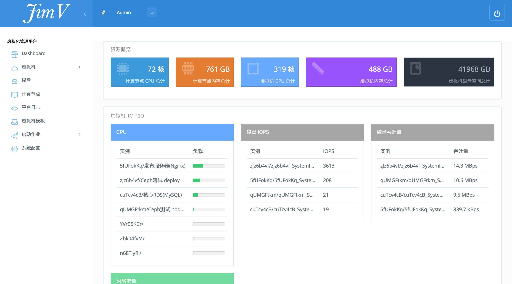
            
            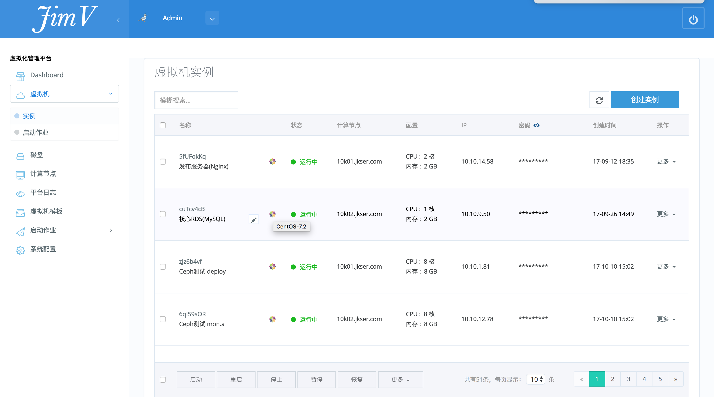
            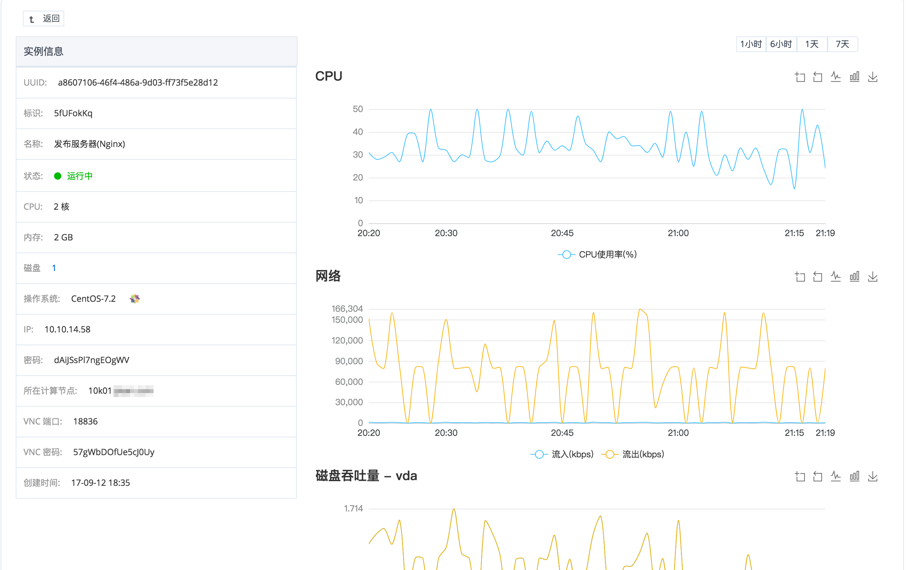
            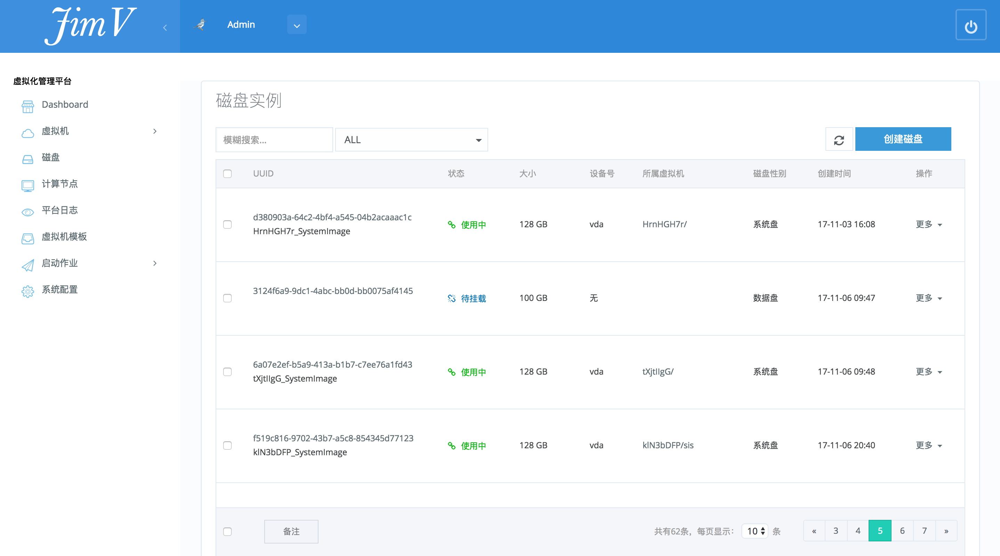
            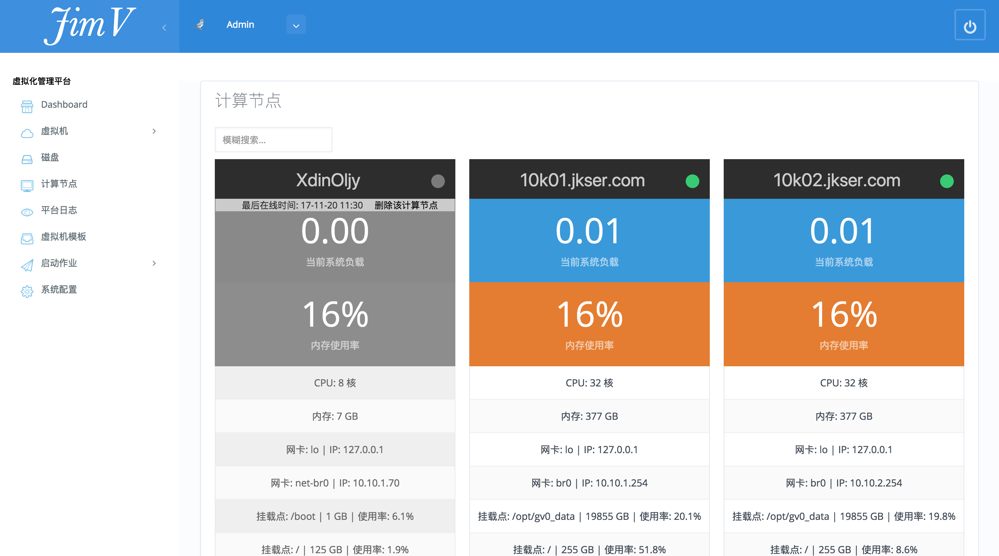
            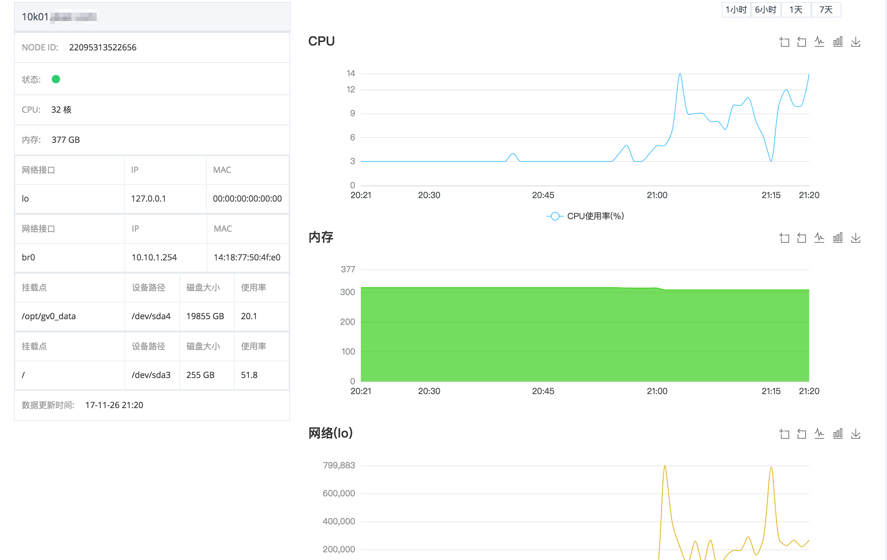
            
            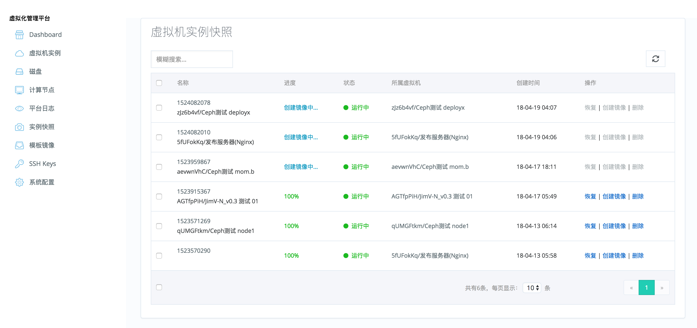
            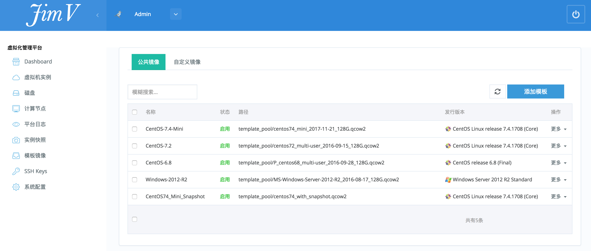
            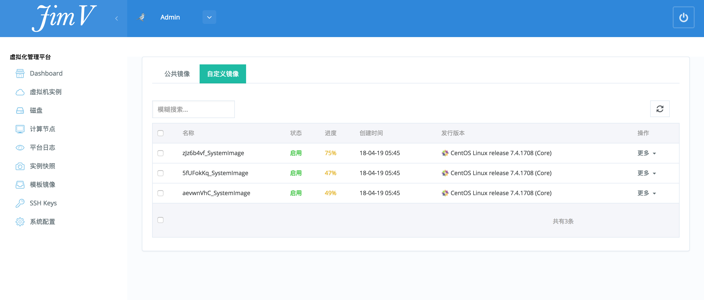
            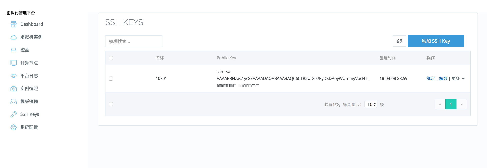
            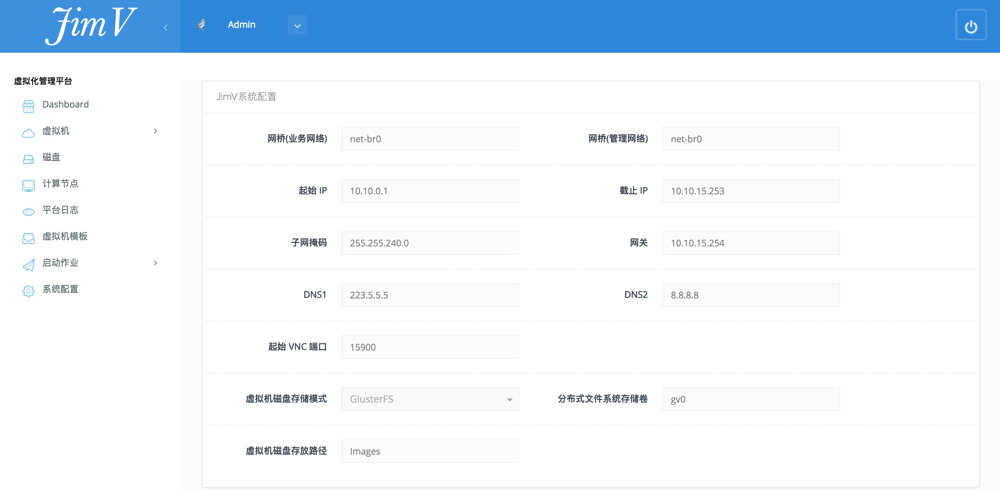
        

    

