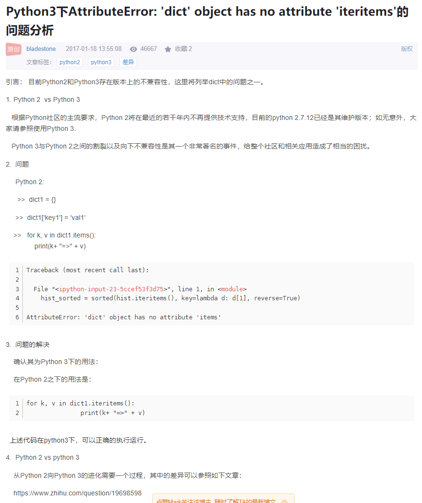
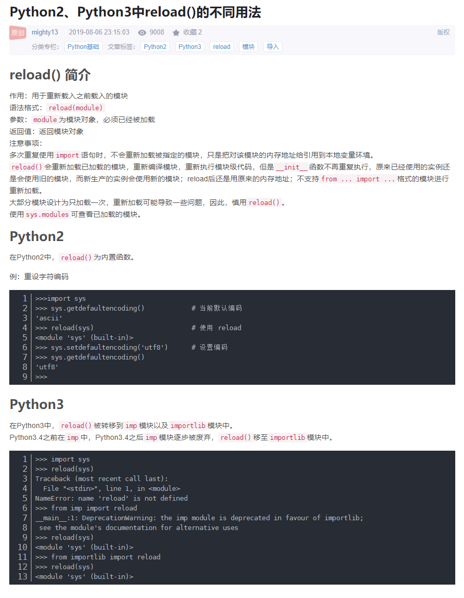
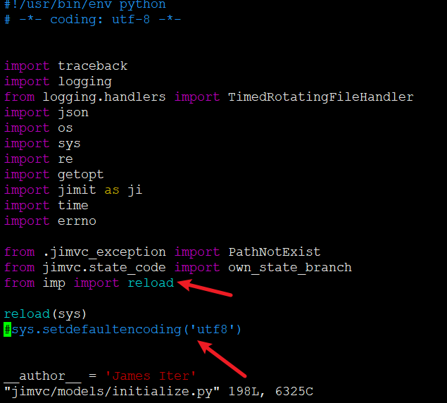
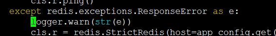
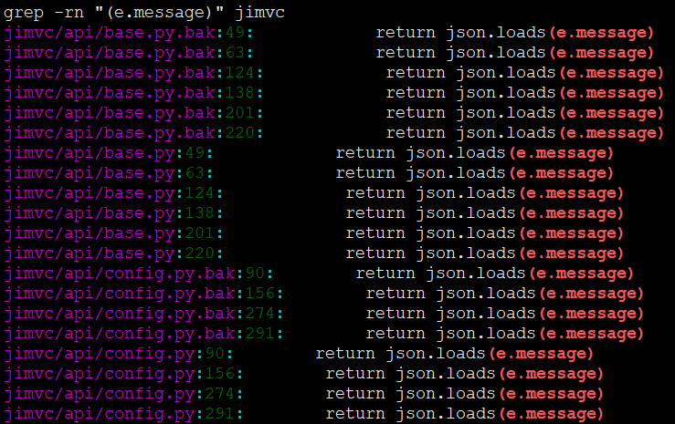
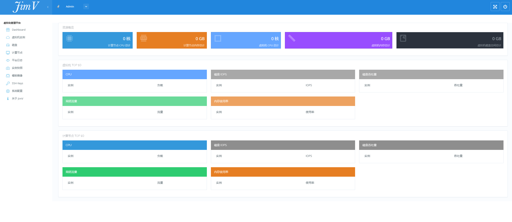

# 将jimv项目从python2转为python3

## step1 使用2to3工具


## step2 手动修改如下内容

* iteritems修改为items




需要全局替换

```
find ./jimvc -name "*.py" | xargs sed -i  "s%.iteritems()%.items()%g"
```


* reload需要导入包才能使用，需要配置defaultcodding





* 所有的e.message改为str(e)即可





需要全局替换

```
find ./jimvc -name "*.py" | xargs sed -i  "s%(e.message)%str(e)%g"
```

* json.loadsstr()修改

需要全局替换

```
find ./jimvc -name "*.py" | xargs sed -i  "s%json.loadsstr(e)%json.loads(str(e))%g"
```




* 跑起来是没有问题，但是需要各个功能都试一试，后续有发现bug继续补充就是
* python3版本将会上传到另一个分支，enjoy everyone~

---
