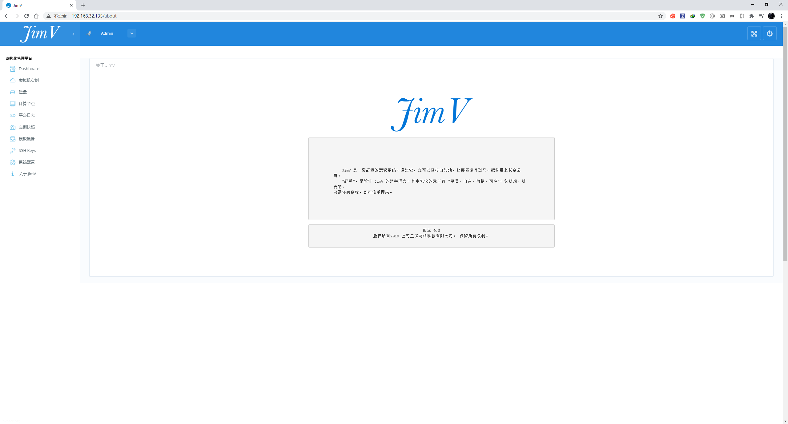
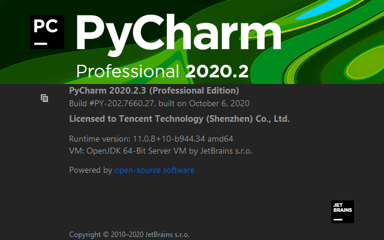
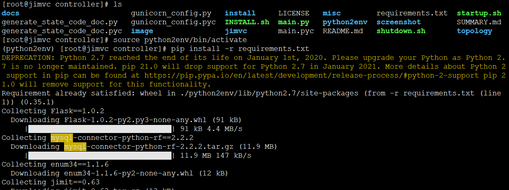
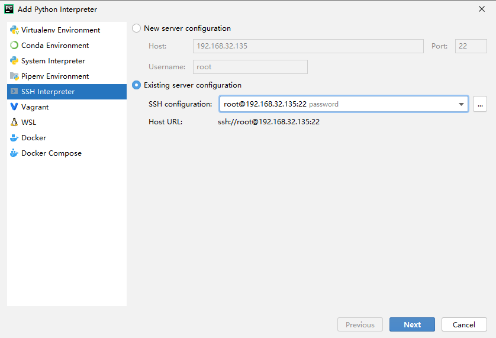
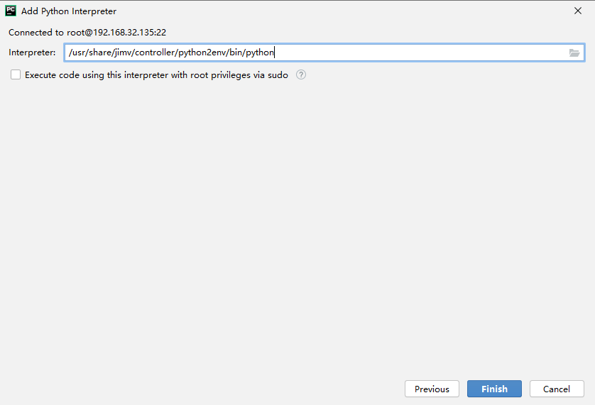
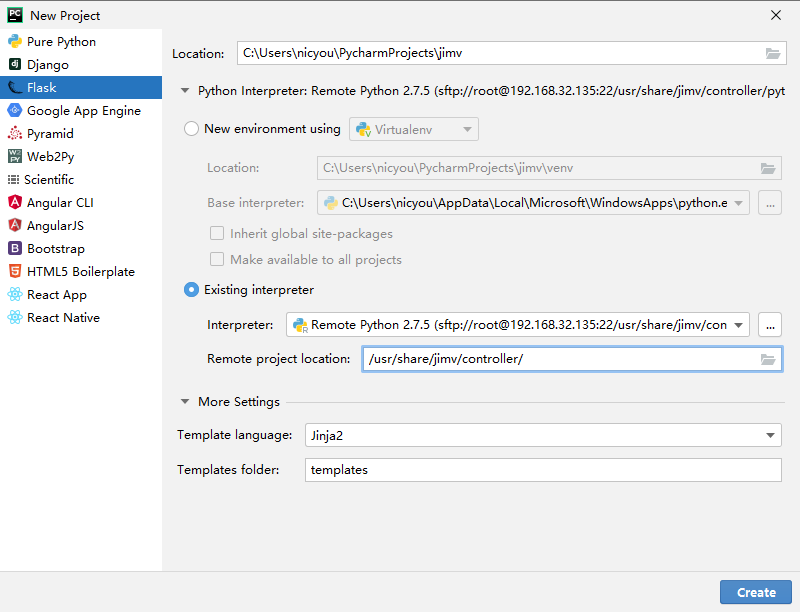
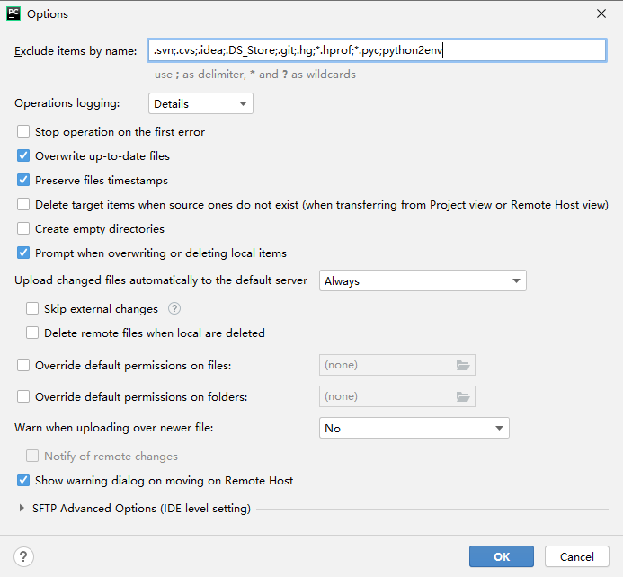
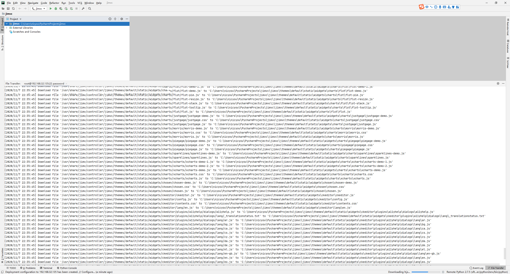
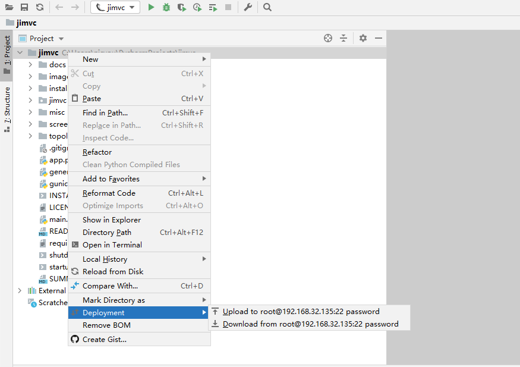
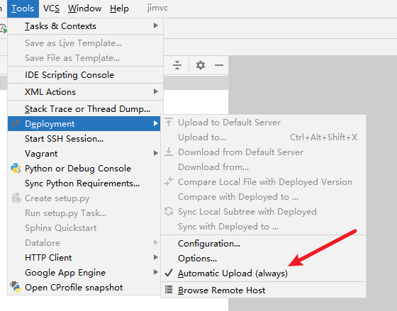

# 搭建pycharm开发环境

## 选择jimv v0.8版本

* 比较老，最初开源的版本





## pycharm构建远程开发




* 构建一个virtual python虚拟环境

```
pip install virtualenv
virtualenv python2env
```



```
source python2env/bin/activate

pip install -r requirements.txt
```

* 启用虚拟环境，安装依赖








* 不要同步python2env虚拟环境



* 从服务器同步文件





* 配置自动上传



---
